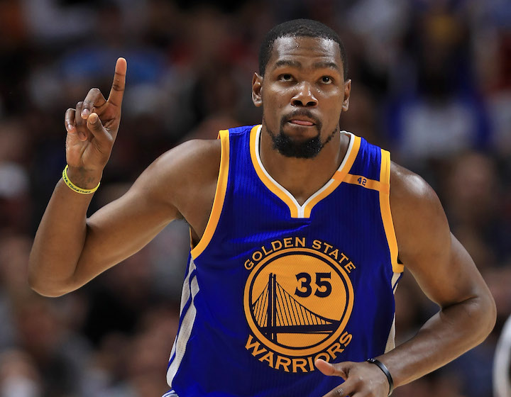
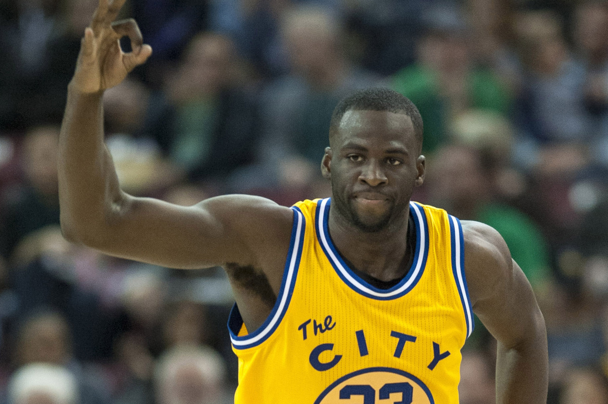
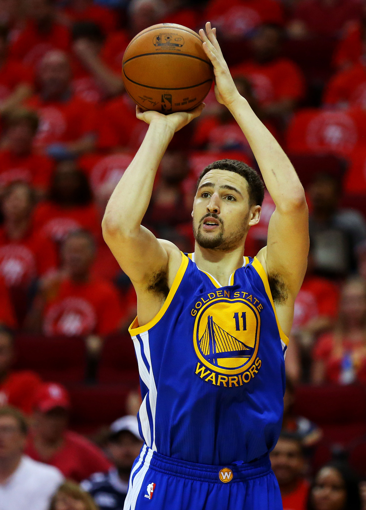
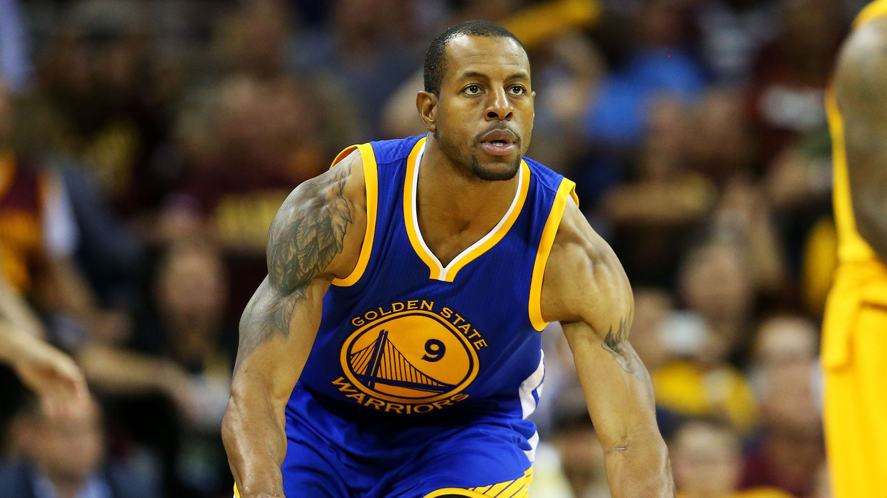
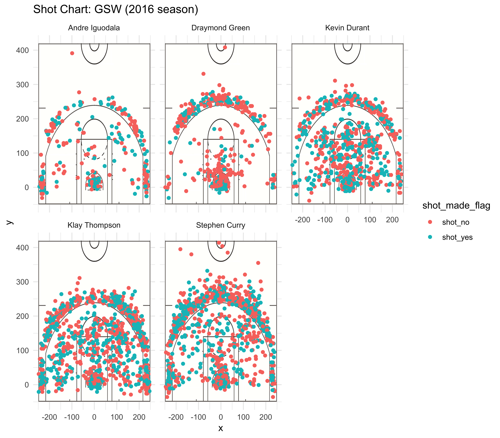

workout01-tristan-wells.Rmd
================
Tristan Wells
3/9/2019

``` r
getwd()
```

    ## [1] "/Users/administrator/Desktop/Stat133/Stat133-hw/Workouts/workout01/report"

``` r
#setwd("../workout01/report")
#setwd("../code")
library(dplyr)
```

    ## 
    ## Attaching package: 'dplyr'

    ## The following objects are masked from 'package:stats':
    ## 
    ##     filter, lag

    ## The following objects are masked from 'package:base':
    ## 
    ##     intersect, setdiff, setequal, union

``` r
library(jpeg)
library(grid)
library(ggplot2)

##import shots data
shots_data <- read.csv("../data/shots-data.csv")

## 2PT Effective Shooting % by Player:
two_pointers_made <- filter(shots_data, shot_type == "2PT Field Goal" & shot_made_flag == "shot_yes")
two_pointers_made <- two_pointers_made %>%
  group_by(name) %>%
  summarise(made = sum(shot_made_flag == 'shot_yes'))

two_pointers_missed <- filter(shots_data, shot_type == "2PT Field Goal" & shot_made_flag == "shot_no")
two_pointers_missed <- two_pointers_missed %>%
  group_by(name) %>%
  summarise(missed = sum(shot_made_flag == 'shot_no'))

two_pointers <- merge(two_pointers_made, two_pointers_missed, by = "name")

two_point_shooting <- two_pointers %>%
  mutate(perc_made = 
           (made/(made + missed))*100) %>% 
  mutate(total = made + missed) %>%
  select(name, total, made, perc_made) %>%
  arrange(desc(perc_made))
  

## 3PT Effective Shooting % by Player: 

three_pointers_made <- filter(shots_data, shot_type == "3PT Field Goal" &
                                shot_made_flag == "shot_yes")
three_pointers_made <- three_pointers_made %>%
  group_by(name) %>%
  summarise(made = sum(shot_made_flag == 'shot_yes'))

three_pointers_missed <- filter(shots_data, shot_type == "3PT Field Goal" &
                                  shot_made_flag == "shot_no")
three_pointers_missed <- three_pointers_missed %>%
  group_by(name) %>%
  summarise(missed = sum(shot_made_flag == 'shot_no'))

three_pointers <- merge(three_pointers_made, three_pointers_missed, by = "name")

three_point_shooting <- three_pointers %>%
  mutate(perc_made = (made/(made + missed))*100) %>% 
  mutate(total = made + missed) %>%
  select(name, total, made, perc_made) %>%
  arrange(desc(perc_made))
  
  
## Effective Shooting % by Player: 

effective_shooting <- three_point_shooting %>%
  mutate(total = two_point_shooting$total + three_point_shooting$total, 
         made = two_point_shooting$made + three_point_shooting$made,
         effective_perc_made = made/(total)*100,
         three_point_perc = three_point_shooting$perc_made,
         two_point_perc = two_point_shooting$perc_made) %>%
  select(name, total, made, two_point_perc, three_point_perc, effective_perc_made)
```

Is Stephen Curry Really The Best Player on the Golden State Warriors?
=====================================================================

Introduction
------------

### In 2016, the Golden State Warriors were notably the most sucessful team, with the most wins of the season, at 67 wins. The next two teams with the most wins were the San Antonio Spurs, and the Houston Rockets, coming in at 61 and 55 wins respectively. There is no question that the Warriors success was related to their stacked team, where four players (Durant, Curry, Thompson, and Green) were selected to play in the All-Star Game. That being said, much of the media coverage was pointed towards Stephen Curry, making him out to be the best player on the Golden State Warriors during that season. However, as impressive as his statistics and performance might be, there are other factors to consider when determing the "best" team player. Kevin Durant, for example, was named finals MVP, putting him under strong consideration as the best player for the warriors. And as mentioned above, the Warriors had at least 2 other All-Star players from this season, and so it is certainly worth taking a look at a few more statistics before reaching a conclusion.


Some Background About the Warriors
----------------------------------

### (background)

### In the 2016 season, the warriors were first in the league, for the second consecutive season(1). Even with four All-Star players from the 2016 season, the team had five captains who all experienced the title of All-Star some time in their career. In 2016 it was Steph, Kevin, Draymond Green, and Klay Thompson, but the other captain, Andre Iguodala, was an All-Star in 2012, and was twice named to the NBA All-defensive team. So that being said, the team was pretty stacked.

Steph
-----


Kevin Durant
------------



Draymond Green
--------------



Klay Thompson
-------------



Andre Iguodala
--------------



### Before diving into analysis, it is important to note the different positions of each player.

Curry and Klay each hold the more aggressive guard positions, which puts them in a position to shoot more often than the other captains. Draymond and Durant are slightly more defensive, occupying forward positions, with Andre listed as a versitile player, in terms of positions he can play, meant to occupy many positions. Noting the position of each player, and their opportunity for shots will be important while evaluating each player.

Just the Points
---------------

### (data)

### When it comes down to winning a game, scoring the most points turns out to be more important than other statistics such as the percent of shots made that actually go in. From that stand point, the five players can be ranked as follows for the total number of points scored in the 2016 season.

| name           |  made|
|:---------------|-----:|
| Stephen Curry  |   670|
| Kevin Durant   |   409|
| Andre Iguodala |   387|
| Klay Thompson  |   380|
| Draymond Green |   245|

### In terms of "most points," Klay and Curry are tied for first, followed by Green, Durant, and the Iguodala.

### However, as mentioned earlier, it is important to keep in mind that this does not take into account the opportunities each player had to make a shot, given the variety of positions. It was noted that both Curry and Klay hold the most offensive positions, and therefore should be expected to make more points than the other captains. Lets take a look at how many shots each player made in 2016, regardless of whether or not it was a scoring shot.

| name           |  total|
|:---------------|------:|
| Stephen Curry  |   1330|
| Kevin Durant   |    835|
| Andre Iguodala |    801|
| Klay Thompson  |    790|
| Draymond Green |    578|

### As you can see, Curry and Klay clearly took more shots than other players, however, Klay made less shots, with the same total points as Curry. Additionally, Durant made less shots than Andre, and yet made more points. Lets take a look at the percentage of shots made per shot by each player.

| name           |  effective\_perc\_made|
|:---------------|----------------------:|
| Stephen Curry  |               50.37594|
| Kevin Durant   |               48.98204|
| Andre Iguodala |               48.31461|
| Klay Thompson  |               48.10127|
| Draymond Green |               42.38754|

### This is interesting. Klay has a significantly higher percentage (almost 5% more than Curry) of shots made, and Green, whohad the third highest number of points scored is last amongst the percentage of effective shots made.

### Another important note is that not all shots are created equal. It really depends on whether or not we are talking about two-pointers or 3-pointers. How do the effective shots change if we look at the effective points of 2-pointers?

| name           |  two\_point\_perc|
|:---------------|-----------------:|
| Klay Thompson  |          63.80952|
| Stephen Curry  |          60.65319|
| Kevin Durant   |          53.99645|
| Andre Iguodala |          51.40625|
| Draymond Green |          49.42197|

### Once again, Klay Thompson beats out the other captains, making over 50% of the two-pointers he shoots. That being said, Curry is well known for his three-pointers, and so it is worth taking a look at those statistics as well.

| name           |  three\_point\_perc|
|:---------------|-------------------:|
| Klay Thompson  |            42.41379|
| Stephen Curry  |            40.75691|
| Kevin Durant   |            38.60294|
| Andre Iguodala |            36.02484|
| Draymond Green |            31.89655|

### Aha, even when comparing three-pointers, Klay Thompson beats out Stephen Curry.

Below is a representation of the shots made by each player, and where they were on the court when each shot was made.



### This is an interesting way to view the shots made, and the difference in activity for each player, where clearly Klay and Stephen have the most shot activity.

So, what does all of this mean?
-------------------------------

### (analysis)

### If we were to rank each player by most points scored, highest effective two-point shot percentage, and highest effective three-point shot percentage, the winner would unquestionably be Klay Thompson; he was tied with Curry for most points, and was well above in effective shooting percentage in both two and three-pointers. If we take into account the exposure that each player has to the ball and being a position to shoot a point, we could look at overall effective shooting percentage, and Klay would still rank the highest based on this ranking system.

Other Considerations?
---------------------

### (discussion)

### Although this analysis is quite representative (for the 2016 season) of how effective the captains are at making shots, as well as the total numbe of points each player made during the season, there are some important elements that were not taken into consideration which could have an affect on the overall evaluation of player importance to the Golden State Warriors.

### Of these factors, the different positions of each player was not used to evaluate the players valubility in terms of defense or assists.

### The number of games played by each player also would have an affect of the total number of points scored per player. At some point during the season, for example, Stephen Curry was injured and did not play for a number of games, and this could easily have affected the number of points her scored.

### This analysis is only representative of one season, and could easily vary if it included previous and later seasons.

### All of these factors considered, it is still interesting that Stephen Curry and Kevin Durant both won Western Conference Player of the Week awards during the season, Durant won Finals MVP, Draymond won Defensive Player of the Year, and Steph Recieved the most media. This is interesting because there is no question that Klay made more points with a higher effective shot percentage than any of these players, and recieved significantly fewer awards.

Last Words
----------

### (conclusion)

### Without looking much deeper into other considerations, this analysis has shown that, although Steph Curry is a valuable player, and Durant won the *Most Valuable Player*, Klay Thompson scored the most points, with the highest effective shooting percentage for both two and three-pointers. Based on this analysis alone, Klay was easily more valuable than Steph Curry to the Golden State Warrriors for his excellence in shooting statistics.

References:
-----------

### (1) <https://en.wikipedia.org/wiki/2016%E2%80%9317_Golden_State_Warriors_season>

### (2) <https://www.si.com/nba/2016/04/25/stephen-curry-warriors-knee-injury-impact-nba-playoffs-cavaliers-spurs-thunder>

### (3) <https://www.si.com/more-sports/2015/12/27/most-fascinating-sports-person-2016-stephen-curry>

### (4)
